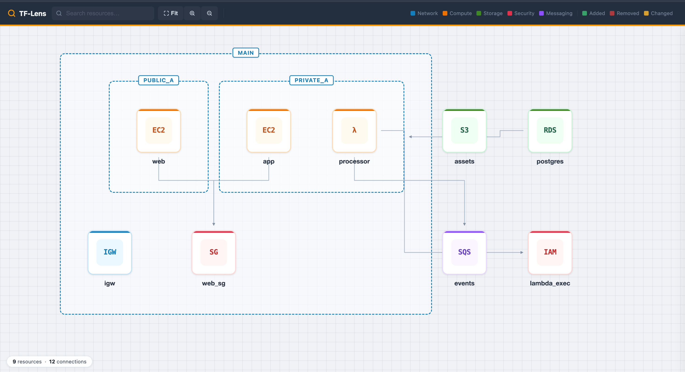

# 🔭 TF-Lens

**Terraform infrastructure visualisation — CLI-first, offline-capable, open source.**

TF-Lens parses Terraform plan and state files and renders them as clean, interactive AWS architecture diagrams. Single statically-linked Go binary. No cloud account. No runtime dependencies.

[](https://github.com/hack-monk/tf-lens/actions/workflows/ci.yml)
[](https://goreportcard.com/report/github.com/hack-monk/tf-lens)
[](LICENSE)
[](https://github.com/hack-monk/tf-lens/releases)

---



**[Live Demo](https://hack-monk.github.io/tf-lens/demo.html)** — interactive diagram with cost, threat, and drift overlays

## Why TF-Lens?

| Problem | TF-Lens |
|---|---|
| `terraform graph` is unreadable dependency spaghetti | VPC → Subnet → Instance compound nesting |
| Lucidchart / Visio diagrams go stale instantly | Generated directly from your plan or state file |
| Pluralith requires a cloud account and SaaS setup | Fully offline, single binary, no account |
| No free diff view for PR reviews | Built-in green/red/amber diff mode |
| No free security overlay for Terraform | Threat modelling: SG exposure, unencrypted storage, public RDS, IAM wildcards |
| Cost visibility requires separate tooling | Infracost-powered cost overlay — per-resource and total monthly estimates |
| Manual cloud changes go unnoticed | State drift detection — compare live AWS state against Terraform |

---

## Features

**`tf-lens export`** — self-contained HTML file, works offline, shareable via Slack/email/PR attachment

**`tf-lens serve`** — local HTTP server, opens in browser automatically, Refresh button for live reload

**Diff mode** — compare two plans or plan vs state, node cards show what changed at a glance

**Threat modelling** — detects 79 security misconfigurations across 30 AWS resource types including SGs, S3, RDS, IAM, Lambda, EKS, ElastiCache, SQS, SNS, CloudFront, KMS, ECR, API Gateway, OpenSearch, Redshift, ECS, CloudTrail, and more

**Cost overlay** — Infracost integration shows per-resource monthly cost on node cards and total estimate in the statusbar

**State drift detection** — detects manual AWS changes by comparing live cloud state against Terraform, highlights drifted resources with attribute-level diffs

**Traffic flow visualisation** — infers runtime traffic and data flow paths between resources (ALB→EC2, APIGW→Lambda, SQS→Lambda, etc.) with a toggleable overlay view

**Watch mode** — `tf-lens serve --watch` auto-reloads the diagram when input files change, with SSE-powered browser refresh

**Module grouping** — Terraform modules rendered as compound container nodes, with proper nesting for nested modules

**Export formats** — `--format html` (default), `--format json` (machine-readable), `--format threats` (Markdown security report)

**AWS-style diagram** — category-coloured cards, dashed VPC/subnet containers with labels on the border line, right-angle edge routing

---

## Quick Start

```bash
# 1. Generate a plan file
terraform plan -out=plan.bin
terraform show -json plan.bin > plan.json

# 2. Export a self-contained diagram (works offline)
tf-lens export --plan plan.json --out diagram.html
open diagram.html

# 3. Or start a live interactive server with auto-reload
tf-lens serve --plan plan.json --watch
# Opens http://localhost:7777 automatically, reloads on file changes

# 4. Full pipeline: diff + threat + cost + drift + flow
tf-lens export --plan new.json --diff old.json --threat --cost cost.json --drift drift.json --flow --out full.html
```

---

## Installation

### Build from source

```bash
git clone https://github.com/hack-monk/tf-lens.git
cd tf-lens
make bundle   # downloads Cytoscape.js + Dagre (~900KB total)
make build
./tf-lens version
```

### Download a release binary

```bash
# macOS arm64 (Apple Silicon)
curl -fsSL https://github.com/hack-monk/tf-lens/releases/latest/download/tf-lens_darwin_arm64.tar.gz \
  | tar -xz && sudo mv tf-lens /usr/local/bin/

# Linux amd64
curl -fsSL https://github.com/hack-monk/tf-lens/releases/latest/download/tf-lens_linux_amd64.tar.gz \
  | tar -xz && sudo mv tf-lens /usr/local/bin/
```

---

## CLI Reference

### Export mode

```
tf-lens export [flags]

  --plan        Path to terraform show -json output (plan JSON)
  --state       Path to terraform.tfstate file
  --out         Output HTML file path (default: diagram.html)
  --diff        Base plan/state to diff against — enables diff mode
  --threat      Run threat modelling and overlay findings on diagram
  --cost        Cost overlay: Infracost JSON file, or Terraform dir to auto-run infracost
  --drift       Drift detection: refresh-only plan JSON, or Terraform dir to auto-run
  --flow        Infer and overlay runtime traffic/data flow paths
  --format      Output format: html (default), json, or threats
  --icon-dir    Directory with custom SVG icons (optional)
```

### Serve mode

```
tf-lens serve [flags]

  --plan        Path to terraform show -json output
  --state       Path to terraform.tfstate file
  --port        HTTP port (default: 7777)
  --diff        Base plan/state to diff against
  --threat      Run threat modelling overlay
  --cost        Cost overlay: Infracost JSON file, or Terraform dir to auto-run infracost
  --drift       Drift detection: refresh-only plan JSON, or Terraform dir to auto-run
  --flow        Infer and overlay runtime traffic/data flow paths
  --watch       Watch input files for changes and auto-reload diagram
  --no-open     Don't open browser automatically
```

---

## Diff Mode

Compare two plans, or a plan against a saved state, to see exactly what Terraform will change:

```bash
tf-lens export \
  --plan new_plan.json \
  --diff old_plan.json \
  --out changes.html
```

The CLI prints a summary:
```
📊  Diff summary:
    ✅  Added:     1
    ❌  Removed:   4
    🔄  Updated:   1
    ─   Unchanged: 7
```

Node cards show coloured outlines: **green** (added) · **red dashed** (removed) · **amber** (changed).

---

## Threat Modelling

Run security analysis directly on your Terraform plan:

```bash
tf-lens export --plan plan.json --threat --out security.html
```

The CLI prints a severity-sorted summary:
```
🔒  Threat model summary:
    🔴 Critical: 2
    🟠 High:     3
    🟡 Medium:   4
    🔵 Info:     3
```

Affected node cards show a severity badge. Click any node to open the detail panel with full findings:

- **Severity badge** — colour-coded label (CRITICAL / HIGH / MEDIUM / INFO)
- **Finding code** — e.g. `SG002`, `RDS001`
- **Title** — short description of what was detected
- **Detail** — explains exactly what was found and why it matters
- **Fix** — concrete remediation steps in a highlighted box

**79 detection rules across 30 resource types:**

| Resource | Checks |
|---|---|
| `aws_security_group` | Open to internet (0.0.0.0/0), all-ports exposure, unrestricted egress |
| `aws_s3_bucket` | Public ACL, website hosting, no encryption, no versioning |
| `aws_db_instance` | Unencrypted storage, publicly accessible, no backups, no deletion protection |
| `aws_db_cluster` (RDS Cluster) | Unencrypted, publicly accessible, no backups, no deletion protection |
| `aws_iam_role` | Wildcard trust policy, wildcard Action/Resource in inline policies |
| `aws_lambda_function` | Not in VPC, possible hardcoded secrets in environment variables |
| `aws_eks_cluster` | Public API endpoint, no KMS secrets encryption |
| `aws_elasticache_cluster` | No at-rest encryption, no in-transit encryption |
| `aws_sqs_queue` | No encryption |
| `aws_sns_topic` | No KMS encryption |
| `aws_cloudfront_distribution` | Outdated TLS version, no WAF |
| `aws_kms_key` | Key rotation disabled, overly permissive key policy |
| `aws_ecr_repository` | No image scanning, no tag immutability, no encryption |
| `aws_api_gateway_rest_api` | No authorizer, no WAF, no access logging |
| `aws_opensearch_domain` | Not in VPC, no encryption at rest/in transit, no fine-grained access |
| `aws_redshift_cluster` | Unencrypted, publicly accessible, no audit logging |
| `aws_ecs_task_definition` | Privileged containers, root user, no logging |
| `aws_instance` (EC2) | No IMDSv2, public IP, no monitoring, no EBS optimization |
| `aws_ebs_volume` | Unencrypted volumes |
| `aws_efs_file_system` | Unencrypted, no backups |
| `aws_cloudtrail` | Not multi-region, no log validation, no encryption, no log insights |
| `aws_alb` / `aws_lb` | No access logs, not internal, no deletion protection, HTTP listeners |
| `aws_launch_template` | No IMDSv2, no monitoring |
| `aws_secretsmanager_secret` | No KMS encryption, no rotation |
| `aws_kinesis_stream` | Unencrypted |
| `aws_msk_cluster` | No in-transit encryption, no at-rest encryption, no enhanced monitoring |
| `aws_docdb_cluster` | Unencrypted, no audit logs, no deletion protection |
| `aws_neptune_cluster` | Unencrypted, no audit logs, no deletion protection |
| `aws_codebuild_project` | No encryption, privileged mode, no VPC |

---

## Cost Overlay

Visualise per-resource cloud costs directly on your architecture diagram, powered by [Infracost](https://www.infracost.io/).

### Option A: Auto-run Infracost against your Terraform directory

```bash
# Requires: infracost CLI installed + API key configured
tf-lens export --plan plan.json --cost /path/to/terraform/dir --out costs.html
```

### Option B: Use a pre-generated Infracost JSON file

```bash
infracost breakdown --path . --format json > cost.json
tf-lens export --plan plan.json --cost cost.json --out costs.html
```

The CLI prints a summary:
```
💰  Cost estimate:
    Monthly total: $234.60/mo
    Resources with cost: 3
```

In the diagram:
- Each node with cost shows a **green badge** (top-left corner) with the monthly amount
- A **cost summary pill** in the bottom statusbar shows the total monthly estimate
- Click any node to see its cost in the **detail panel**

---

## State Drift Detection

Detect when someone manually changes AWS resources outside of Terraform:

### Option A: Auto-run Terraform refresh against your directory

```bash
# Requires: terraform CLI + AWS credentials configured
tf-lens export --plan plan.json --drift /path/to/terraform/dir --out drift.html
```

### Option B: Use a pre-generated refresh-only plan

```bash
terraform plan -refresh-only -out=refresh.bin
terraform show -json refresh.bin > drift.json
tf-lens export --plan plan.json --drift drift.json --out drift.html
```

The CLI prints a summary:
```
🔀  State drift detected:
    Drifted resources: 2
    Modified: 2
```

In the diagram:
- Drifted nodes get a **purple outline** and **lightning bolt badge**
- Click any drifted node to see an **attribute-level diff table** (attribute / expected / actual)
- A **drift summary pill** in the bottom statusbar shows total drifted resource count

---

## Traffic Flow Visualisation

Infer and overlay runtime traffic and data flow paths between resources:

```bash
tf-lens export --plan plan.json --flow --out flow.html
tf-lens serve --plan plan.json --flow
```

The diagram adds dashed, colour-coded flow edges alongside dependency edges:
- **Blue** — ingress traffic (ALB → EC2, CloudFront → origin)
- **Green** — data flow (EC2 → RDS, Lambda → DynamoDB/S3)
- **Amber** — event-driven (SQS → Lambda, SNS → SQS, Kinesis → Lambda)

Use the **view toggle** (Dependencies / Flow / Both) to switch between views.

**Inferred flow patterns:**

| Pattern | Example |
|---|---|
| Load balancer → compute | ALB → EC2 (subnet co-location) |
| API Gateway → Lambda | APIGW → Lambda (invoke) |
| Queue/stream → consumer | SQS → Lambda, Kinesis → Lambda |
| Pub/sub fanout | SNS → SQS, SNS → Lambda |
| Compute → database | EC2/ECS → RDS/DynamoDB (same VPC) |
| Lambda → downstream | Lambda → S3/DynamoDB/SQS/SNS/RDS |
| CDN → origin | CloudFront → S3/ALB |
| Audit → storage | CloudTrail → S3 |

---

## Export Formats

```bash
# Default: self-contained HTML diagram
tf-lens export --plan plan.json --out diagram.html

# Machine-readable JSON (includes graph, threats, costs, drift, flow data)
tf-lens export --plan plan.json --threat --cost cost.json --format json --out data.json

# Markdown threat report
tf-lens export --plan plan.json --threat --format threats --out report.md
```

---

## Icon System

TF-Lens ships with 25+ custom SVGs, colour-coded by AWS service category:

| Colour | Category | Examples |
|---|---|---|
| 🔵 Blue | Networking | VPC, Subnet, IGW, NAT, ALB, Route53 |
| 🟠 Orange | Compute | EC2, Lambda, ECS, EKS, ASG, CloudFront |
| 🟢 Green | Storage & DB | S3, RDS, DynamoDB, ElastiCache, EBS, EFS |
| 🔴 Red | Security & IAM | Security Group, IAM Role, KMS, Secrets Manager |
| 🟣 Purple | Messaging | SNS, SQS, API Gateway, CloudWatch |

Want to use the official AWS architecture icons? See [docs/icon-dir.md](docs/icon-dir.md).

---

## Architecture

```
tf-lens/
├── cmd/               # Cobra CLI commands (export, serve, version)
├── internal/
│   ├── parser/        # Terraform plan + state JSON parsing
│   ├── graph/         # Node/edge model, VPC→Subnet nesting, module grouping
│   ├── diff/          # Plan comparison, change classification
│   ├── threat/        # Security misconfiguration detection (79 rules, 30 types)
│   ├── cost/          # Infracost integration — parse JSON or auto-run CLI
│   ├── drift/         # State drift detection — refresh-only plan comparison
│   ├── flow/          # Runtime traffic/data flow inference engine
│   ├── icons/         # SVG resolver (user dir → embed → prefix → fallback)
│   ├── renderer/      # HTML/JSON/Markdown export with Cytoscape.js
│   └── server/        # HTTP server with SSE live reload for serve mode
├── testdata/          # Synthetic Terraform plan fixtures
└── docs/
    ├── ci/            # GitHub Actions + GitLab CI templates
    └── icon-dir.md    # Custom icon documentation
```

Two-mode design:
- **Export** → single offline HTML file, Cytoscape.js embedded via `go:embed`
- **Serve** → local HTTP server, graph data served as JSON from `/api/graph`

---

## Roadmap

**Shipped**
- [x] `tf-lens export` — offline single-file HTML diagram
- [x] `tf-lens serve` — local HTTP server with live refresh
- [x] VPC → Subnet → Instance compound nesting
- [x] Diff mode (added / removed / changed overlays)
- [x] Threat modelling overlay (79 rules across 30 resource types)
- [x] 25+ AWS service icons
- [x] Search / filter
- [x] Click-to-inspect detail panel
- [x] Keyboard shortcuts (F, R, Esc, +/-, /, ?)
- [x] Cost overlay (Infracost integration — file or auto-run)
- [x] Detailed threat findings panel (title, detail, remediation per finding)
- [x] State drift detection (manual AWS change detection with attribute-level diffs)
- [x] Resizable detail panel (drag to adjust width)
- [x] Keyboard shortcut help overlay (press ?)
- [x] Search UX (clear button, result count, / to focus)
- [x] Glassmorphism statusbar + zoom indicator
- [x] `--watch` flag with SSE auto-reload
- [x] Traffic flow inference and visualisation (`--flow`)
- [x] Module grouping (compound nodes for Terraform modules)
- [x] Export formats: HTML, JSON, Markdown threat report
- [x] Edge label inference (61 contextual dependency labels)
- [x] GitHub Actions / GitLab CI templates

**Up next**
- [ ] Azure support (community contribution path)
- [ ] GCP support

---

## Why not Pluralith?

- TF-Lens is fully offline, no account required. Pluralith requires cloud account registration.
- Single 5.5MB binary with `make build`. No complex setup.
- Threat modelling and cost overlays are not available as free features in any competing tool.
- Apache 2.0 — extend it, self-host it, contribute to it.

---

## Contributing

The icon resolver and graph engine are provider-agnostic. Adding Azure or GCP support:

1. Add SVG icons to `internal/icons/svg/` using the `<resource_type>.svg` naming convention
2. Add nesting rules to `internal/graph/graph.go` for the provider's container hierarchy
3. Add detection rules to `internal/threat/detector.go`

Please open an issue before starting significant work.

---

## License

Apache 2.0 — see [LICENSE](LICENSE).
